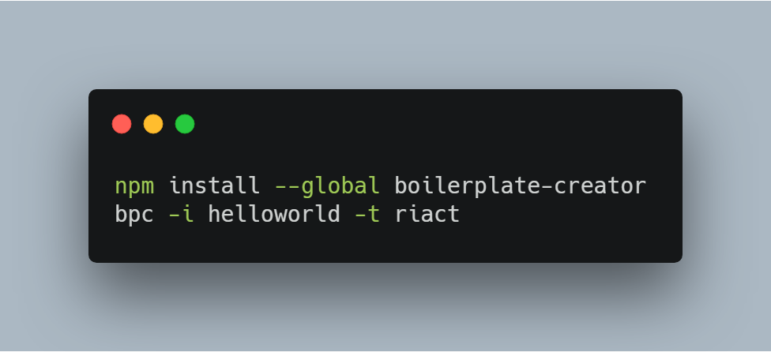

# Riact

A simplified React-like modern frontend framework.

[](https://travis-ci.org/oychao/riact) [](https://996.icu)

## How to use

Check the [demos][1].

Also, a boilerplate cli tool is provided to initiate a project.

<p align="center">
    
</p>

### Component

Currently function component supported only.

```javascript
// .babelrc
{
  //...
  "plugins": [
    ["@babel/plugin-transform-react-jsx", {
      "pragma": "Riact.createElement",
      "pragmaFrag": "Riact.Fragment"
    }],
    //...
  ]
}
```

```javascript
// ./Count.jsx
import Riact, { useState, useEffect } from 'riact';

const Count = function() {
  const [ value, setValue ] = useState(0); // exactly like hooks in React 16.8.
  setTimeout(setValue, 1e3, value + 1); // be careful when using hooks in timer functions, it's kind of tricky.
  useEffect(() => void (console.log(value))); // useEffect basic usage
  return (
    <div>
      <p>{value}</p>
    </div>
  );
};

export default Count;
```

```javascript
// ./app.jsx
import ReactDOM from 'riact';
import Count from './Count';

ReactDom.render(<Count></Count>, document.querySelector('#app'));
```

### Supported Feature / API

1. useState(initStateValue);
2. useEffect(effectCallback);
3. useContext(contextComp);
4. React.createRef();
5. React.createContext(initContextValue);
   1. Context.Provider
   2. Context.Consumer
6. React.memo(FunctionComponent);

## FYI

**NOTE**: Riact is just for learning, it's easy and simple so DO NOT use it to develop complex applications.

## LICENCE

[](https://github.com/996icu/996.ICU/blob/master/LICENSE)

[1]: https://github.com/oychao/riact/tree/master/demos
